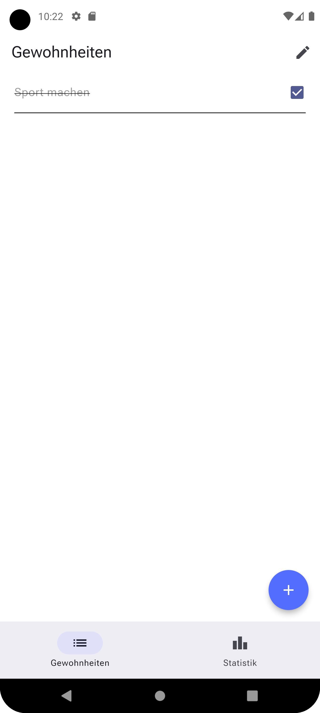
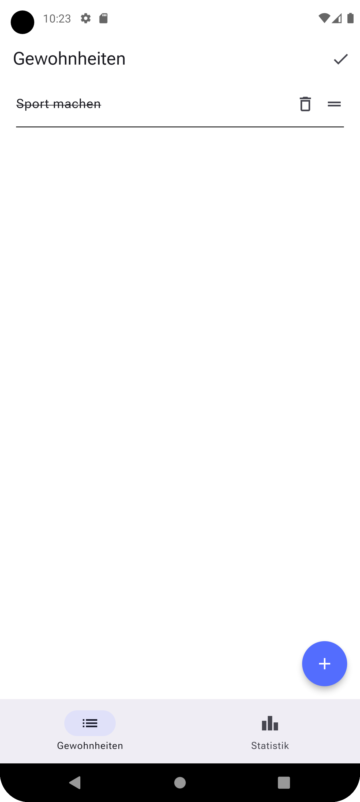
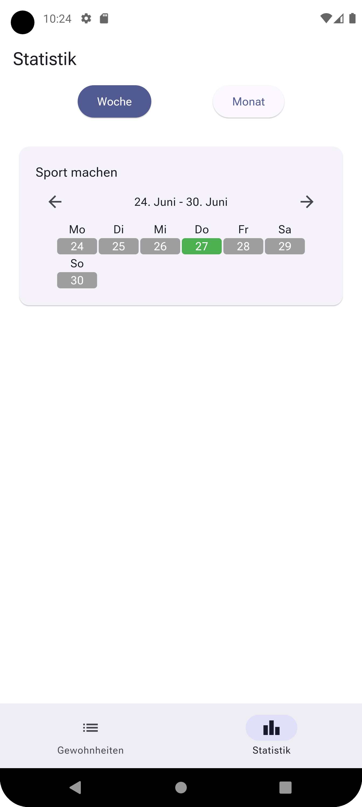
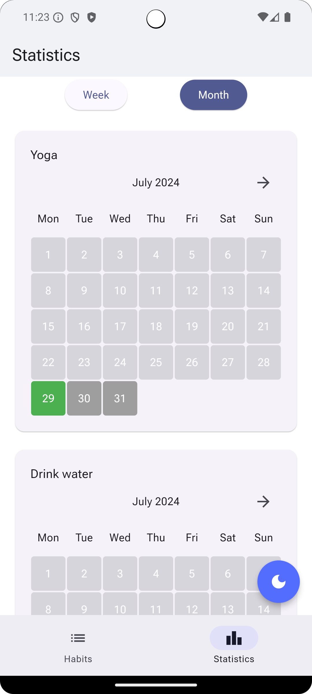
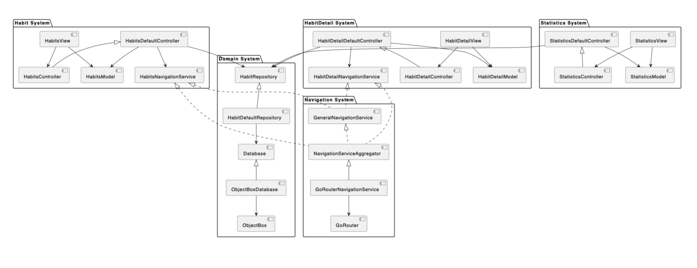

# Yusto

## Abstract

Yusto is a mobile application designed to help users establish, manage, and track their daily habits. Users can add, edit, and monitor their progress through weekly and monthly views. Built with Flutter for an engaging user interface and Riverpod for efficient state management.

## Problem Statement

## Personas

## Screens

    

        
        
List of Habits Checked

    

    

        
        
List of Habits Settings

    

    

        
        
Add Habits

    

    

        
        
Weekly Statistics

    

    

        
        
Monthly Statistics

    

## Architecture

#### System Architecture Overview

This diagram illustrates the architecture of a Habit Tracking System, showcasing the relationships between various subsystems and components. The key subsystems include the Habit System, HabitDetail System, Statistics System, Domain System, and Navigation System. Each subsystem has distinct responsibilities, ensuring modularity and separation of concerns.

The Habit System manages the core functionality related to habits, including views, controllers, models, and navigation services. The HabitDetail System focuses on detailed views and interactions with individual habits. The Statistics System handles the display and processing of statistical data related to habits.

The Domain System acts as the central data management hub, incorporating repositories, databases, and data engines like ObjectBox for efficient data storage and retrieval. The Navigation System facilitates seamless navigation across the application, integrating general and specific navigation services.

#### State Management with Riverpod

Riverpod is employed for state management in Yusto, providing a robust and efficient way to manage application state. It decouples state from UI components, promoting separation of concerns and reactivity, ensuring the UI automatically updates when the state changes. Riverpod's modularity enhances the codebase's maintainability and testability.

