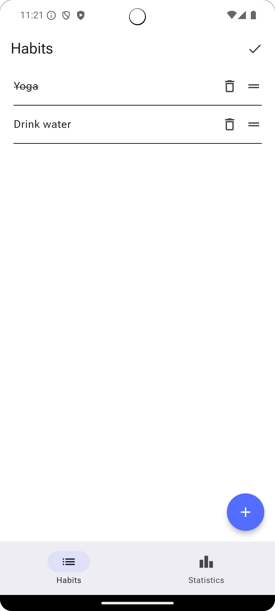
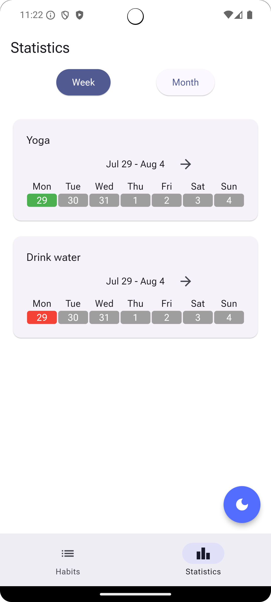

# Yusto

## Abstract

Yusto is a mobile application designed to help users establish, manage, and track their daily habits. Users can add, edit, and monitor their progress through weekly and monthly views. Built with Flutter for an engaging user interface and Riverpod for efficient state management.

## Problem Statement and Solving

The core issue addressed by Yusto is the widespread difficulty people face in establishing positive habits and breaking negative ones, despite understanding the benefits of such changes. This struggle is often due to a lack of consistency and motivation, compounded by the challenges of integrating new behaviors into a busy daily routine. These difficulties can lead to frustration, dissatisfaction, and a decline in both physical and mental health. This problem affects individuals across various domains, including work, personal life, health, and education, whenever they attempt to improve or change their habits for a healthier and more productive lifestyle.

Yusto addresses this problem by providing a comprehensive habit-tracking solution. The app allows users to set, edit, and monitor their habits. By visualizing progress through weekly and monthly statistics, users can stay motivated and gain insights into their achievements, fostering a sense of accomplishment and encouraging continued effort toward habit formation and improvement.

## Personas

#### Health-Conscious Individual

- **Goals:** Establish a routine for long-term well-being and monitor progress.
- **Challenges:** Maintaining motivation and overcoming setbacks.
- **Needs:** A simple tool to track and visualize healthy habits over time.

#### Student

- **Goals:** Manage time effectively and achieve academic success.
- **Challenges:** Balancing study time with other activities and avoiding procrastination.
- **Needs:** A straightforward way to track study habits and assess weekly or monthly progress.

#### High-Performing Professional

- **Goals:** Increase efficiency at work while maintaining personal satisfaction.
- **Challenges:** Handling heavy workloads and achieving work-life balance.
- **Needs:** An easy-to-use platform to track habits and visualize progress to support both professional and personal goals.

## Screens

    
    
    
    
    

## Architecture

#### System Architecture Overview

This diagram illustrates the architecture of a Habit Tracking System, showcasing the relationships between various subsystems and components. The key subsystems include the Habit System, HabitDetail System, Statistics System, Domain System, and Navigation System. Each subsystem has distinct responsibilities, ensuring modularity and separation of concerns.

The Habit System manages the core functionality related to habits, including views, controllers, models, and navigation services. The HabitDetail System focuses on detailed views and interactions with individual habits. The Statistics System handles the display and processing of statistical data related to habits.

The Domain System acts as the central data management hub, incorporating repositories, databases, and data engines like ObjectBox for efficient data storage and retrieval. The Navigation System facilitates seamless navigation across the application, integrating general and specific navigation services.

#### State Management with Riverpod

Riverpod is employed for state management in Yusto, providing a robust and efficient way to manage application state. It decouples state from UI components, promoting separation of concerns and reactivity, ensuring the UI automatically updates when the state changes. Riverpod's modularity enhances the codebase's maintainability and testability.

